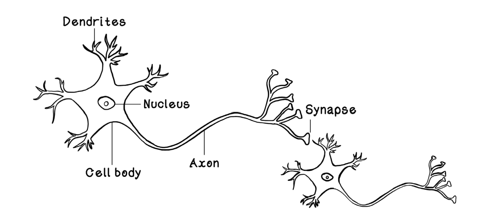

# Sztuczne Sieci Neuronowe

## Spis treści

- [Sztuczne Sieci Neuronowe](#sztuczne-sieci-neuronowe)
  - [Spis treści](#spis-treści)
  - [Wprowadzenie](#wprowadzenie)
    - [Geneza](#geneza)
    - [Zastosowania](#zastosowania)
    - [Propagacja w przód](#propagacja-w-przód)
    - [Propagacja w tył (Backpropagation)](#propagacja-w-tył-backpropagation)
    - [Techniki zapobiegające overfittingowi](#techniki-zapobiegające-overfittingowi)
  - [Architektury ANN](#architektury-ann)
    - [Sieci konwolucyjne (Convolutional Neural Network)](#sieci-konwolucyjne-convolutional-neural-network)
    - [Generatywne Sieci Adwersalne (Generative Adversal Network)](#generatywne-sieci-adwersalne-generative-adversal-network)
    - [Sieci Rekurencyjne (Recurrent Neural Network)](#sieci-rekurencyjne-recurrent-neural-network)
    - [Długa Pamięć Krótkoterminowa LSTM (Long Short-Term Memory)](#długa-pamięć-krótkoterminowa-lstm-long-short-term-memory)
    - [GAT](#gat)
    - [Autoenkodery](#autoenkodery)
    - [Transformery](#transformery)
      - [Mechanizm atencji](#mechanizm-atencji)
      - [Feed forward](#feed-forward)
      - [Enkoder](#enkoder)
      - [Dekoder](#dekoder)
  - [Źródła](#źródła)
  
---

## Wprowadzenie

Rozdział ten opowiada o istocie i zasadzie działania sztucznych sieci neuronowych. Opisuje ich genezę, budowę, zastosowania we współczesnym świecie i mechanizmy, które zachodzą zarówno podczas trenowania, jak i ewaluacji modeli opartych o sztuczne sieci neuronowe.

### Geneza

Bezpośrednią inspiracją dla powstania sztucznych sieci neuronowych (które będę skrótowo odtąd nazywać ANN) jest budowa neuronów w ludzkim mózgu. 

Neurony składają się z dendrytów, jądra komórkowego, ciała komórkowego, aksonu i synaps. Dendrydy otrzymują sygnały z sąsiednich neuronów i przekazują do ciała i jądra komórkowego, które modyfikują sygnał. Akson przekazuje nowy sygnał do synaps podłączonych do dendrydów innych neuronów. 

Sygnały w mózgu przechodzą między neuronami, w których poddawane są indywidualnym procesom transformacji. Siła sygnału wyjściowego neuronu zależy od siły sygnałów wejściowych. 

Twórcy koncepcji ANN zaproponowali, aby siła sygnałów była reprezentowana przez liczby rzeczywiste, a procesy transformacji polegały na obliczaniu wartości funkcji liniowej zawierającej tyle samo zmiennych, co wejść do danego sztucznego neuronu i zastosowaniu na niej funkcji aktywacji, która pozwoli znormalizować wartość siły sygnału w sieci. Jest to bardzo ważne, gdyż bez tego pewne części ANN mogłyby w sposób niezamierzony (i na dodatek nieuczciwy) wpływać na wynik końcowy. 

Przyjmijmy, że sieć neuronowa została wytrenowana do szacowania wartości mieszkania w zależności od metrażu, odległości od centrum i przeciętnych zarobków w tym mieście. Łatwo da się dostrzec, że dziedzina zmiennej opisującej przeciętne pensje mieści się w przedziale kilku, kilkunastu tysięcy. Gdyby nie stosować normalizacji zmiennych, to ta właśnie zmienna "przejęłaby kontrolę" nad modelem, co jest absolutnie niepożądane. Chcemy, aby każda zmienna w modelu miała wstępnie te same szanse. 

### Zastosowania

Sztuczne sieci neuronowe stosuje się m.in. do: 
- szacowania przyszłych cen akcji na giełdzie; 
- oceny ryzyka kredytowego;
- tłumaczenia tekstów na obce języki;
- wykrywania chorób ze zdjęć RTG;
- analizy sentymentu na podstawie wpisów w Internecie;
- generowania muzyki
- generowania filmów i obrazów
- wspomagania podejmowania decyzji w złożonych środowiskach operacyjnych 

### Propagacja w przód

Przyjmijmy, że jest sztuczna sieć neuronowa, która została wytrenowana do predykcji prawdopodobieństwa zawału serca. Jako wejście przyjmuje m.in. współczynnik spożycia alkoholu, palenie papierosów, czas aktywności fizycznej w tygodniu, BMI, ciśnienie krwi, etc.

Sieć neuronowa składa się z 3 warstw, gdzie pierwsza ma 26 neuronów, druga ma 104 neurony, a trzecia ma jeden neuron zwracający wynik od 0 do 1 oznaczający prawdopodobieństwo zawału serca. 

### Propagacja w tył (Backpropagation)

### Techniki zapobiegające overfittingowi

- Regularyzacja lasso L1 i ridge L2
- dropout
- selekcja najistotniejszych zmiennych
- 

## Architektury ANN

### Sieci konwolucyjne (Convolutional Neural Network)

### Generatywne Sieci Adwersalne (Generative Adversal Network)

### Sieci Rekurencyjne (Recurrent Neural Network)

### Długa Pamięć Krótkoterminowa LSTM (Long Short-Term Memory) 

### GAT 

### Autoenkodery

### Transformery

#### Mechanizm atencji

#### Feed forward

#### Enkoder

#### Dekoder

## Źródła
1. R. Hurbans. Grokking Artificial Intelligence Algorithms. Manning Publications Co. Rok wydania 2020. ISBN: 9781617296185
2. L. Tunstall, L. von Werra, T. Wolf. Przetwarzanie języka naturalnego z wykorzystaniem transformerów. Helion S.A. 2024. ISBN: 978-83-289-0711-9
3. https://medium.com/data-science/8-simple-techniques-to-prevent-overfitting-4d443da2ef7d. Dostęp z dnia 31.07.2026 godz. 10:30